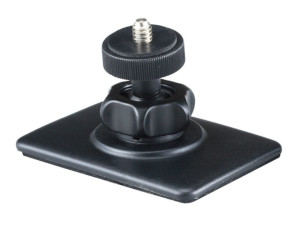

# Smart Car Forensics Cam

This code was modified from a project by [KAZ](https://twitter.com/yokazuya_jp).
[Original article in Japanese](https://qiita.com/yokazuya/items/f36e5a2252bf32b0c18b).

## Usage

### Secure THETA to Dash

Mount THETA with rear lens facing window.  Shutter button should be facing driver.

### Use Extension

using a 1/4" by 20 tpi adapter to allow access to the USB port of the camera.

### Apply USB Power

Plug the USB cord into your vehicle using a USB adapter.

